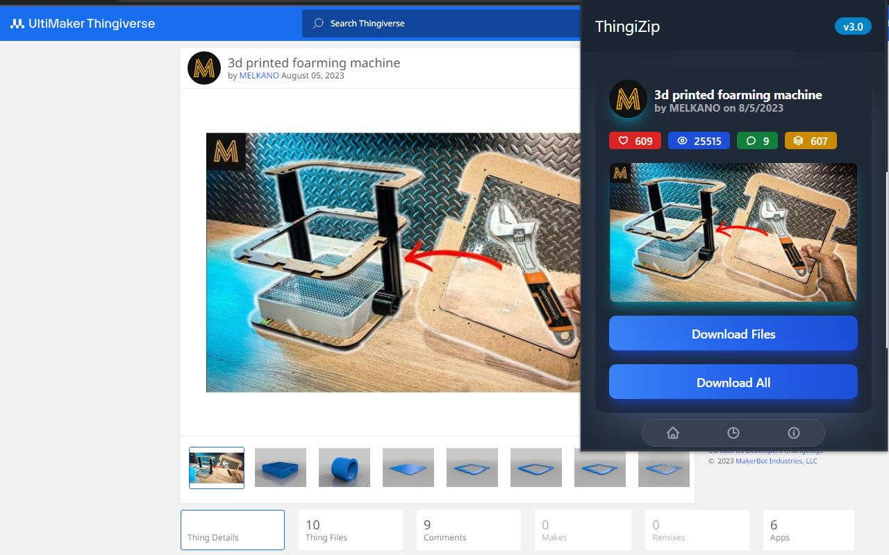
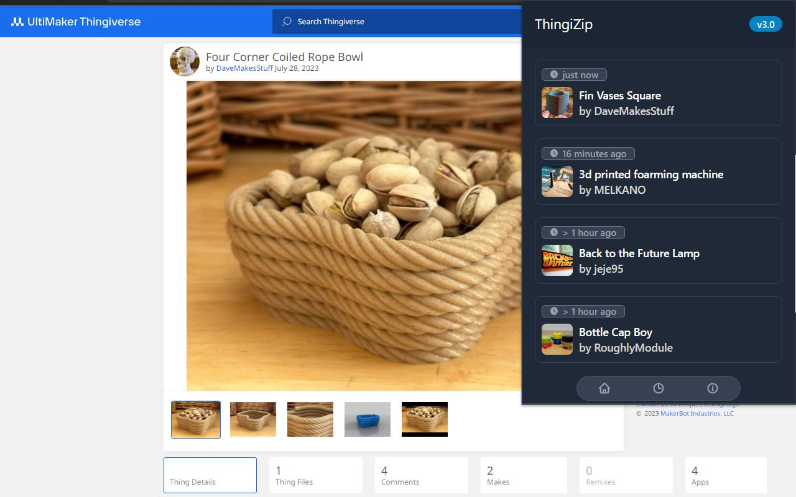

# ThingiZIP 

ThingiZIP is a web browser extension that makes it easy to download images and files from Thingiverse™. This extension creates an interactive popup in the toolbar of your browser. This project utilizes the Thingiverse™ API. Please note that if the Thingiverse™ API changes, the performance and/or functionality of this extension may be impacted.

## Usage

To download a ZIP file, you must be on a valid Thingiverse™ model page.  
Here is an example of the structure of a valid page: `https://www.thingiverse.com/thing:1234567`  

As you can see, a valid page contains a series of numbers preceded by `thing:`  
It doesn't matter if there's anything after the numbers.  
For example, `https://www.thingiverse.com/thing:1234567/files` is also a valid page.  

### Home Page

This is where you will be able to download and view information about the last Thingiverse page you visited.

You can either:
- Download Files: only download the files (`.stl`, `.obj`, `.gcode`... )
- Download All: download the files + images + `details.txt`

### Recents

This is where you will see a history of the previous Thingiverse page that you visited.

Note that information only gets added to the recents whenever you open the extension on a Thingiverse page.
In other words, if you visit a number of pages without opening the extension popup, they will not be added to the recents.

## Issues

If you have any issues, feel free to create a GitHub issue if it hasn't already been addressed.

## Contributing

Contributions are always welcome!

## Ressources Used

- [TailwindCSS](https://tailwindcss.com/) : extension UI
- [Svelte](https://svelte.dev/) : extension UI
- [Heroicons](https://heroicons.com/) : icons
- [JSZip](https://stuk.github.io/jszip/) : create zip files
- [JSZip Utils](https://github.com/Stuk/jszip-utils) : create zip files
- [FileSaver](https://github.com/eligrey/FileSaver.js/) : save zip files

## Download

- [Chrome Web Store](https://chrome.google.com/webstore/detail/thingizip/maonfmeilcpjfdipacfehiidjngcoama)
- [Firefox Addon Store](https://addons.mozilla.org/en-CA/firefox/addon/thingizip/)
