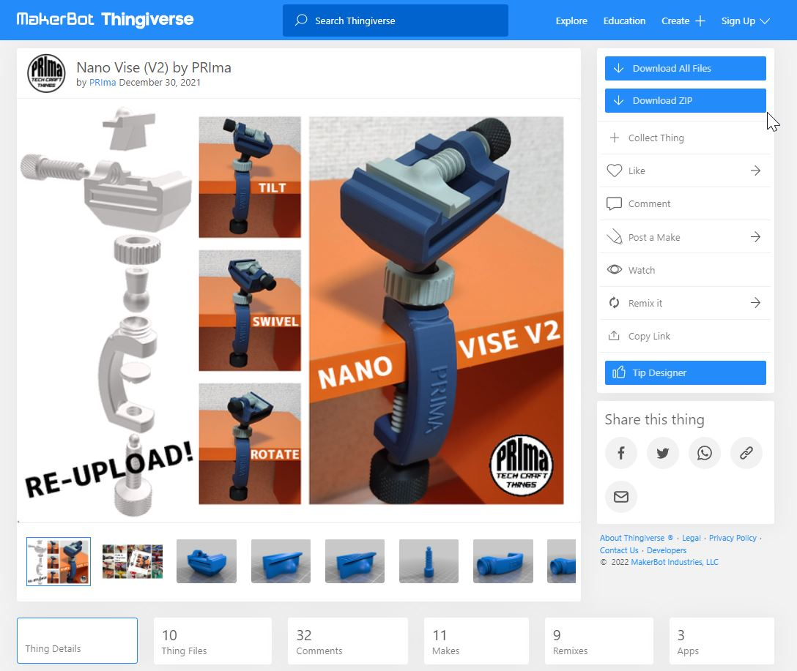

# ThingiZIP  
ThingiZIP is a web browser extension that makes it easy to download images and STL files from Thingiverse™. This extension creates a download button on the page when viewing a model on Thingiverse™ and an interactable popup in the toolbar of your browser. This project utilizes the Thingiverse™ API. Please note that if the Thingiverse™ API changes, the performance and/or functionality of this extension may be impacted.

## Usage
To download a ZIP file, you must be on a valid Thingiverse™ model page.  
Here is an example of the structure of a valid page: `https://www.thingiverse.com/thing:1234567`  

As you can see, a valid page contains a series of numbers preceded by `thing:`  
It doesn't matter if there's anything after the numbers.  
For example, `https://www.thingiverse.com/thing:1234567/files` is also a valid page.  

This extension creates a download button right under the original download button from Thingiverse™.  
There are 2 ways of downloading using ThingiZIP.

1. From a valid Thingiverse™ page
    - Click the `Download ZIP` button on the Thingiverse™ page.  
    
        
2. From the ThingiZIP popup
    - Click on the extension logo in the extensions bar (usually on the top right corner of the browser)
    - You then have the option to download a ZIP file by clicking the `Download ZIP` button.
    
        
    *If the button is greyed out (disabled) then it means that you are not currently on a valid Thingiverse™ page. If you believe that this is a mistake, you can refresh the Thingiverse™ and reopen the extension popup. This should fix the issue.

When the download is complete, you will have a zip containing 3 items.
- An `Images` directory containing all the images related to that model.
- A `Files` directory containing all the files provided by the creator. 
- An `Info.txt` file containing all the information provided by the creator.

## Issues

If you have any issues, feel free to create a GitHub issue if it hasn't already been addressed.

## Contributing

Contributions are always welcome!

#### Ideas

- Show recently visited Thingiverse™ model page on the extension popup home page.
- UI/UX overhaul
- New settings

## Ressources Used
- [Bootstrap](https://getbootstrap.com/) : extension popup UI
- [Bootstrap Icons](https://icons.getbootstrap.com/) : all icons from extension popup
- [Google Fonts (Roboto)](https://fonts.google.com/specimen/Roboto?query=roboto) : Roboto font in popup UI
- [JSZip](https://stuk.github.io/jszip/) : create ZIP files
- [JSZip Utils](https://github.com/Stuk/jszip-utils) : create zip files
- [FileSaver](https://github.com/eligrey/FileSaver.js/) : save ZIP files 
## Download

- [Chrome Web Store](https://chrome.google.com/webstore/category/extensions)
- [Firefox Addon Store ](https://addons.mozilla.org/en-CA/firefox/)

## Screenshots
### Download from website

### Download from popup

### Settings page

